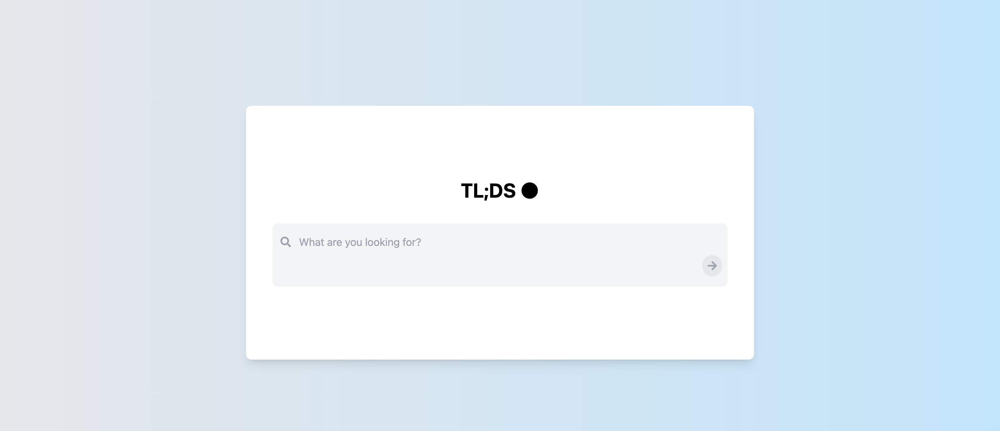

# TL;DS (Too Lazy; Didn't Search)



## Overview

TL;DS (Too Lazy; Didn't Search) is a showcase project demonstrating my ability to create high-quality front-end and back-end AI applications using modern frameworks and packages. For demonstration purposes, this project aims to replicate OpenAI's SearchGPT, which is yet to be released to the public.

The application combines advanced AI capabilities with a SearchGPT inspired, user-friendly interface to provide an enhanced search experience. It leverages state-of-the-art language models and search technologies to deliver accurate, up-to-date information in response to user queries.

## Implementation

TL;DS is built using a robust tech stack that includes:

- **Frontend**: HTML, CSS (Tailwind CSS), and JavaScript
- **Backend**: Python with Flask
- **AI Model**: OpenAI's GPT-4o-mini
- **Search Functionality**: LangChain for AI-driven search operations
- **SERP API**: Docker container running OpenSERP for Google search queries
- **Additional Libraries**: Requests and BeautifulSoup for web scraping

The application uses LangChain to orchestrate the AI model's interactions with the search functionality. This allows for dynamic, context-aware searches that can be chained together for complex queries.

## Functionality

TL;DS offers a unique search experience:

1. **User Query**: Users can enter any query into the search box.

2. **AI-Driven Search**: The AI model analyzes the query and determines what information it needs to look up using Google.

3. **Intelligent Information Gathering**: For complex, multi-part queries, the AI can string together multiple individual search queries to gather all necessary information.

4. **Up-to-Date Sources**: The AI provides responses with up-to-date sources as hyperlinks, ensuring the information is current and verifiable.

5. **Transparent Results**: Users can switch to the "Google Search" tab to view the sources referenced by the AI during its search process.

6. **Raw Data Access**: For those interested in the underlying data, a "Raw Data" tab is available to view the JSON response from the server.

This functionality demonstrates the power of combining AI language models with real-time web search capabilities, providing users with a comprehensive and intelligent search tool.

## Getting Started

To run TL;DS on your local machine, follow these steps:

1. Ensure you have Docker installed. If not, you can install it using:
   ```bash
   sudo apt-get install docker.io -y
   ```

2. Clone the repository:
   ```bash
   git clone https://github.com/andrewcampi/TLDS.git
   ```

3. Navigate to the project directory:
   ```bash
   cd TLDS
   ```

4. Install the required Python packages:
   ```bash
   pip3 install -r requirements.txt
   ```

5. Store your OpenAI API key on the first line of a new file named ".env", like this:
    ```
    OPENAI_API_KEY=copy-and-paste-your-key-here
    ```

5. Run the application:
   ```bash
   python3 main.py
   ```

6. Access the web interface at the URL provided in the output of the previous command.

Happy searching!